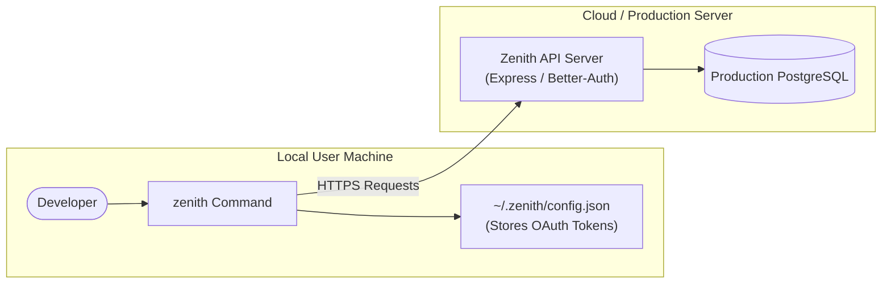

# 🚀 Publishing Zenith CLI to NPM: Production Guide

This guide walks you through transforming the **Zenith CLI** codebase into a production-grade, globally installable NPM package. 

Currently, your CLI code (`server/src/cli`) is closely coupled with your backend server (e.g., directly importing database adapters/Prisma and reading server configurations). To release a package that users can install globally via `npm install -g zenith-cli` or run on-demand via `npx zenith-cli`, you need to **decouple the CLI**, **bundle it**, **configure package settings**, and **publish it**.

---

## 🗺️ Architectural Roadmap
In a real production environment, a CLI package follows a decoupled client-server architecture:



---

## 🛠️ Step 1: Decoupling the CLI from direct Database Access
Currently, files like `login.ts` and `chatWithAI.ts` import `prisma` directly:
```typescript
import prisma from "../../lib/db"; // ❌ FAILS in production (no local DB on user machine)
```

### ✅ Solution: Move Database Logic to Server Endpoints
1. **Define API routes on the Express Server** (e.g., `GET /api/user/whoami`, `POST /api/chats`, `POST /api/chats/message`).
2. **Refactor the CLI to use `fetch`** or an HTTP client (like `axios` or native `fetch` in Node/Bun) to talk to those endpoints:

#### Example: Refactoring `whoamiAction`
*Before (Direct DB query in CLI):*
```typescript
const user = await prisma.user.findFirst({ ... }); // ❌ Local dependency
```

*After (Decoupled API call in CLI):*
```typescript
const response = await fetch(`${serverUrl}/api/user/whoami`, {
  headers: {
    Authorization: `Bearer ${token.access_token}`
  }
});
const user = await response.json();
```

---

## 📦 Step 2: Separate CLI into its Own Sub-Package (Recommended)
Rather than publishing your entire monorepo (which contains backend API, migration files, Next.js frontend, etc.), you should create a dedicated package directory for the CLI.

1. Create a `packages/cli` directory:
   ```bash
   mkdir -p packages/cli/src
   ```
2. Move the CLI source code (`server/src/cli/*`) into `packages/cli/src/`.
3. Create a clean, dedicated `package.json` in `packages/cli/package.json`.

---

## ⚙️ Step 3: Configure `packages/cli/package.json`
Your package configuration must define metadata, bin command mappings, build outputs, and published file scopes.

Create `packages/cli/package.json` with the following structure:

```json
{
  "name": "zenith-cli",
  "version": "1.0.0",
  "description": "The next-generation terminal-first developer workspace powered by Gemini",
  "type": "module",
  "main": "./dist/index.js",
  "types": "./dist/index.d.ts",
  "bin": {
    "zenith": "./dist/bin/zenith.js"
  },
  "files": [
    "dist",
    "README.md",
    "LICENSE"
  ],
  "engines": {
    "node": ">=18.0.0"
  },
  "scripts": {
    "build": "tsup",
    "prepublishOnly": "npm run build"
  },
  "dependencies": {
    "@clack/prompts": "^1.4.0",
    "better-auth": "^1.6.11",
    "boxen": "^8.0.1",
    "chalk": "^5.0.0",
    "commander": "^12.0.0",
    "dotenv": "^17.0.0",
    "figlet": "^1.6.0",
    "marked": "^11.0.0",
    "marked-terminal": "^6.0.0",
    "open": "^10.0.0",
    "yocto-spinner": "^1.0.0",
    "zod": "^3.22.0"
  },
  "devDependencies": {
    "tsup": "^8.0.0",
    "typescript": "^5.0.0",
    "@types/node": "^20.0.0",
    "@types/figlet": "^1.5.0"
  },
  "keywords": [
    "cli",
    "gemini",
    "ai",
    "agent",
    "developer-tools",
    "terminal"
  ],
  "author": "Your Name <your.email@example.com>",
  "license": "MIT",
  "repository": {
    "type": "git",
    "url": "git+https://github.com/your-username/Zenith-CLI.git"
  }
}
```

### Key Fields Explained:
* **`bin`**: Maps the terminal command (`zenith`) to your compiled script.
* **`files`**: Restricts what files get uploaded to the NPM Registry. This prevents your raw source code, test files, and workspace assets from bloating the download size.
* **`prepublishOnly`**: Automatically compiles your TypeScript code to JavaScript every time you run `npm publish` to ensure you never release outdated files.

---

## ⚡ Step 4: Add Bundling and Shebang Resolution
Since your package runs in a terminal environment, the entry point must have a **shebang** telling the operating system how to run it.

1. Ensure the entry point file (e.g., `packages/cli/src/bin/zenith.ts`) starts with a shebang:
   ```typescript
   #!/usr/bin/env node
   ```
   *(Note: If you target **Bun** explicitly, use `#!/usr/bin/env bun`, but `node` is recommended for general compatibility.)*

2. Setup **tsup** (an extremely fast bundler powered by `esbuild`) to bundle your TS code. 
   Create `packages/cli/tsup.config.ts`:
   ```typescript
   import { defineConfig } from "tsup";

   export default defineConfig({
     entry: ["src/bin/zenith.ts"],
     format: ["esm"],
     dts: true,
     clean: true,
     minify: true,
     shims: true, // Injects node globals for ESM compatibility
     banner: {
       // Workaround for shebang validation in compiled bundle outputs
       js: "#!/usr/bin/env node",
     },
   });
   ```

---

## 🧪 Step 5: Test Your CLI Package Locally
Before publishing to the live NPM registry, verify that the compiled bundle installs and executes properly.

### Method A: Local Packaging (Safest)
1. Run `npm pack` inside `packages/cli`:
   ```bash
   npm pack
   ```
   This generates a tarball named `zenith-cli-1.0.0.tgz` representing exactly what will be uploaded to npm.
2. Install the tarball globally to test it:
   ```bash
   npm install -g ./zenith-cli-1.0.0.tgz
   ```
3. Run the CLI command:
   ```bash
   zenith wakeup
   ```
4. Verify everything works, then uninstall:
   ```bash
   npm uninstall -g zenith-cli
   ```

### Method B: Package Linking (Hot Reloading)
1. Inside `packages/cli`, run:
   ```bash
   npm link
   ```
   This creates a symbolic link between your project directory and npm's global bin folder.
2. Run `zenith` anywhere on your machine. Any edits you make and rebuild (`npm run build`) will take effect immediately.
3. Once finished, unlink the CLI:
   ```bash
   npm unlink -g zenith-cli
   ```

---

## 🚀 Step 6: Publish to the NPM Registry
Once local testing passes, you are ready to publish!

### 1. Create an NPM Account
If you do not have an NPM account, create one at [npmjs.com](https://www.npmjs.com/signup).

### 2. Log in from your Terminal
Run the login command and complete the authentication process in your browser:
```bash
npm login
```

### 3. Check for Package Name Availability
NPM package names must be globally unique. Verify `zenith-cli` is not taken:
```bash
npm info zenith-cli
```
* If it returns package details, it is **taken**. You will need to change the `"name"` in your `package.json` to something else (e.g. `zenith-developer-cli` or a scoped package name like `@yourusername/zenith`).
* If it returns a `404 Not Found` error, it is **available** for you to claim!

### 4. Publish the Package
Publish to the public registry:
```bash
npm publish --access public
```

---

## 🤖 Step 7: Continuous Integration & Updates

### 1. Versioning (SemVer)
To push updates, you must bump the version number in `package.json` before running `npm publish`. NPM uses **Semantic Versioning** (`major.minor.patch`):
```bash
# Bumps patch (1.0.0 -> 1.0.1) - for bugs / internal improvements
npm version patch

# Bumps minor (1.0.0 -> 1.1.0) - for new backward-compatible features
npm version minor

# Bumps major (1.0.0 -> 2.0.0) - for breaking changes
npm version major
```

### 2. Auto-Publish via GitHub Actions
Add a GitHub Action to automatically publish your package when you push a new release tag.
Create `.github/workflows/publish.yml`:

```yaml
name: Publish to NPM

on:
  release:
    types: [created]

jobs:
  publish:
    runs-on: ubuntu-latest
    steps:
      - uses: actions/checkout@v4
      - uses: actions/setup-node@v4
        with:
          node-version: 20
          registry-url: 'https://registry.npmjs.org'
      - name: Install dependencies
        run: npm ci
        working-directory: ./packages/cli
      - name: Build package
        run: npm run build
        working-directory: ./packages/cli
      - name: Publish to NPM
        run: npm publish --access public
        env:
          NODE_AUTH_TOKEN: ${{ secrets.NPM_TOKEN }}
        working-directory: ./packages/cli
```
*Generate an automation token on [npmjs.com/settings/tokens](https://www.npmjs.com/settings/tokens) and add it as a secret named `NPM_TOKEN` in your GitHub Repository settings.*
